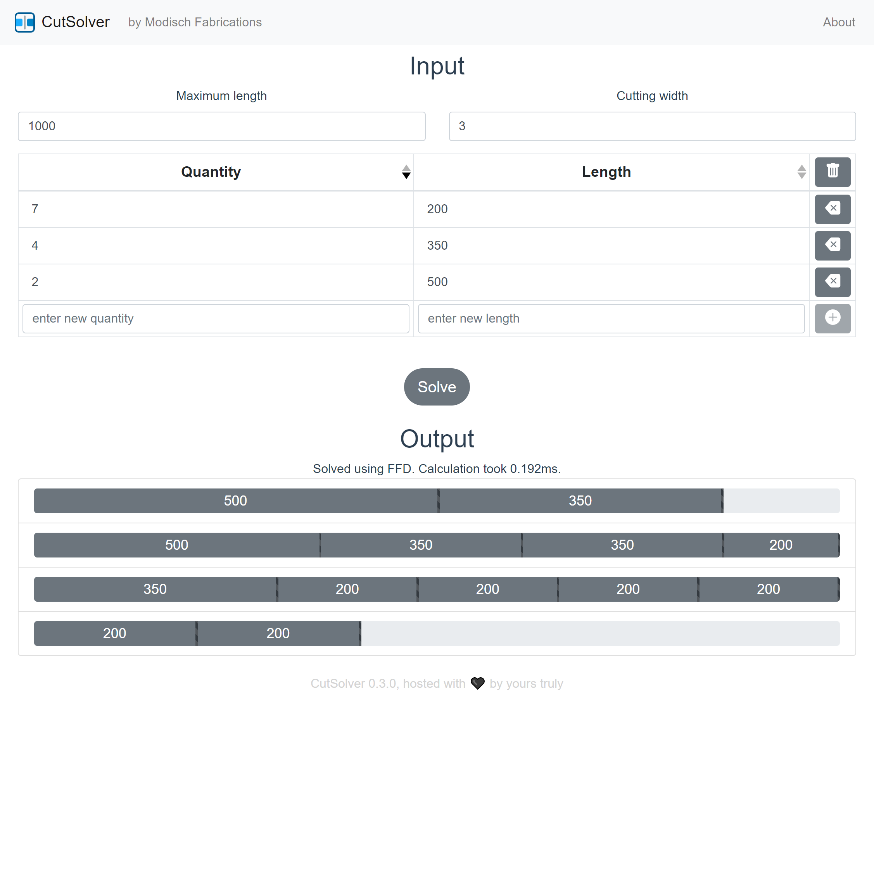

# CutSolverFrontend

[](https://vuejs.org/)
[](https://travis-ci.org/ModischFabrications/CutSolverFrontend)
[](https://hub.docker.com/repository/docker/modischfabrications/cutsolver_frontend)
[](https://hub.docker.com/repository/docker/modischfabrications/cutsolver)



***WIP***

This is a simple frontend based on vue for [CutSolver](https://github.com/ModischFabrications/CutSolver), my solver for ideal stock cutting lengths. 

It's also my first vue project, you should keep looking for better references. 

## Usage
### Recommended, batteries included
Use the provided Docker compose file, add in your URL, done!

Set the backend path by adding a `VUE_APP_BACKEND_SOLVER_URL` to your environment or compose file.
See docker compose for details. 

### Manual
I assume you know what you are doing if you want to install it manually.
Here are some hints for you if you need some help regardless.

#### Initial setup
```
npm install
```

#### Compiles and hot-reloads for development
```
npm run serve
```

#### Compiles and minifies for production
```
npm run build
```

## Tools & Stack
This project uses:
1. [WebStorm](https://www.jetbrains.com/webstorm/) as IDE (while I have it as a student)
1. [Vue (2)](https://vuejs.org/) for everything
2. [Vue Bootstrap](https://bootstrap-vue.js.org/) for style
3. [VueShowdown](https://vue-showdown.js.org/) for markdown parsing
4. [Eslint](https://eslint.vuejs.org/) for linting and code formatting

## Contributing
Remember to set all versions for new releases:
 1. git tag
 2. package.json 
 3. Docker Multibuild (might be done by travis eventually)

Update all dependencies completely with `vue upgrade && npm install` whenever possible, webdev is perpetually broken. 
`npm outdated` in combination with `npm install TODO@latest` can be used to migrate to new major versions. 
*Make sure to test it before committing!*
